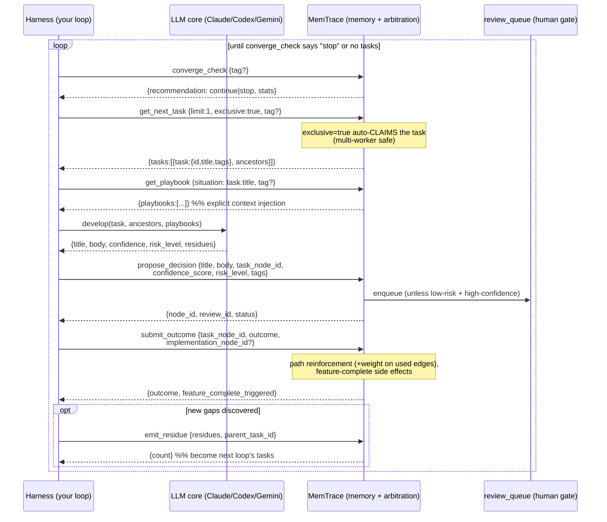
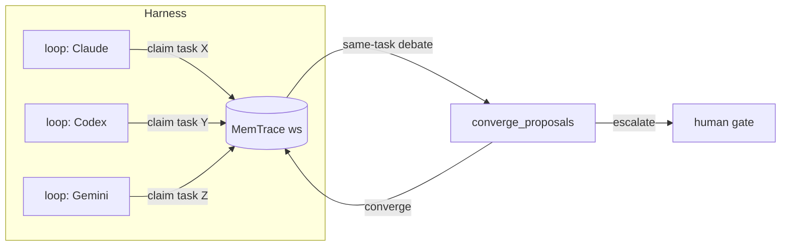

# Harness ↔ MemTrace Integration

How an external agent **harness** (the loop runtime that calls LLMs, runs
tool-use, manages context) plugs into MemTrace (the **memory + arbitration**
layer). This mirrors the reference harness in
[`examples/agent-loop-kb/run_loop.py`](../examples/agent-loop-kb/run_loop.py).

Boundary (axiom **A1**): MemTrace never calls an LLM. Your harness owns the
loop; MemTrace owns task selection, memory retrieval, write-back, and the
human gate.

---

## Transport

Every call is one MCP tool invocation over Streamable HTTP:

```
POST {base_url}/api/v1/mcp/mcp
Authorization: Bearer $MEMTRACE_TOKEN
Content-Type: application/json

{ "jsonrpc": "2.0", "id": <n>, "method": "tools/call",
  "params": { "name": "<tool>", "arguments": { "workspace_id": "<ws>", ... } } }
```

`workspace_id` is implicit on every call. The result text is JSON in
`result.content[0].text`.

---

## One full cycle (single planner + developer)



---

## Step-by-step API map

| # | Phase | Tool | Key args | Returns | Notes |
|---|-------|------|----------|---------|-------|
| 1 | decide | `converge_check` | `tag?` | `recommendation`, `stats` | `continue` → run another cycle |
| 2 | plan | `get_next_task` | `limit`, `exclusive:true`, `tag?` | `tasks[]` (+`ancestors`) | `exclusive` auto-claims → multi-worker safe |
| 3 | context | `get_playbook` | `situation`(=task title), `tag?` | `playbooks[]` | the "explicit context injection" |
| 4 | act | *(your code)* `develop()` | task, playbooks | `{title, body, confidence, risk_level, residues}` | **only part you write** |
| 5 | write-back | `propose_decision` | `title`, `body`, `task_node_id`, `confidence_score`, `risk_level`, `tags` | `node_id`, `review_id`, `status` | enters review_queue unless low-risk+high-confidence |
| 6 | reinforce | `submit_outcome` | `task_node_id`, `outcome`, `implementation_node_id?` | `outcome`, `feature_complete_triggered` | path reinforcement + co-access boost |
| 7 | residue | `emit_residue` | `residues[]`, `parent_task_id` | `count` | new pending inquiries for next loop |

Retrieval helpers usable inside `develop()`: `search_nodes`, `traverse`,
`get_node`, `consult` (ask a second model as reviewer), `wait_for_embedding`.

---

## Going multi-model

- Run **one `WorkLoop` instance per core**, all sharing the same `ws_id`
  (shared memory). Each calls `get_next_task(exclusive=true)` → they claim
  **different** tasks and never collide. Pair with git worktrees for file
  isolation.
- For **debate on the same task**: each core writes a proposal, then
  `converge_proposals {proposals[], task_node_id}` → `converge` or `escalate`
  (escalate = send to human gate).



---

## Ready today vs. gaps

**Ready:** the full single-loop above, the MCP spine, `run_loop.py`,
OpenAI-compatible RAG chat, scoped API keys.

**Gaps (tracked in `ws_spec_plan`):**

- Multi-planner fan-out orchestration — *who* launches N planners (`mem_inq001`).
  Today your harness fans out itself.
- Conductor / webhook push (`mem_inq004`) — today the harness **polls**
  `get_next_task`; there is no event push yet.
- Claim registry is in-process (lost on restart, not shared) (`mem_inq002`).
- per-model competence profile — not yet built.
